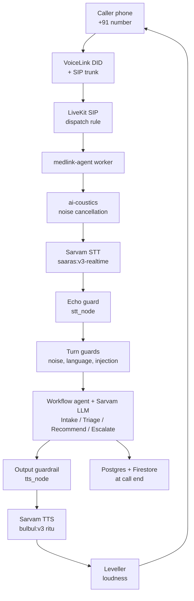
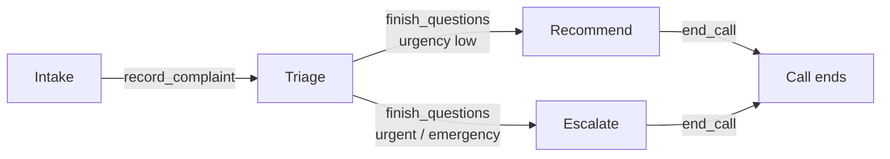
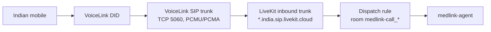

# MedLink Voice Agent

2026-09-23 · Dharanish Vijayakumar

MedLink is a phone-based, multilingual AI health helpline for rural India: a caller dials an ordinary +91 number and talks to a voice agent in English, Hindi, Tamil, Telugu, Kannada or Malayalam. This report covers the `medlink-agent` codebase end to end.

## 1. Overview

MedLink works on an ordinary phone call, with no smartphone, app or data connection needed. It listens to the problem, asks a few targeted follow-up questions, scores how serious it is, and gives safe over-the-counter (OTC) and home-care guidance when appropriate. When it is not safe to self-treat, it pushes the caller toward a doctor or an ambulance (108 / 112).

**Core design principle:** the LLM handles the conversation. Deterministic code chooses medicines, scores severity and filters for safety. The model only reads back medicine text that code has built from a curated formulary.

| Property | Value |
| --- | --- |
| Product | Voice AI health helpline (triage + OTC guidance), not a doctor |
| Target users | Rural Indian callers on feature phones / landlines |
| Languages | English, Hindi, Tamil, Telugu, Kannada, Malayalam + code-mixed speech |
| Access channel | Live Indian number **+91 94293 97308** (inbound PSTN), plus LiveKit web/console |
| AI vendor | Sarvam AI for all three stages (STT, LLM, TTS) on one API key |
| Runtime | Python 3.10–3.14, LiveKit Agents ≥ 1.8.1 |
| Code size | ~20,100 tracked lines; 27 Python source modules in `src/` |
| Tests | 438 pytest tests, all passing (16 s, no network) + 16 LLM simulation scenarios |
| History | 154 commits; MedLink work starts at "Add MedLink safety core" on top of LiveKit's MIT `agent-starter-python` template |
| Remote | `github.com/dharanishvijayakumar7-lgtm/medlink-voice-agent` |
| Clinical status | Guideline-based (WHO IMCI, ICMR STG, NICE CKS) but **not yet reviewed by a licensed clinician** |

## 2. Tech stack

The whole voice pipeline runs on Sarvam AI plus LiveKit Cloud. Everything else is open-source Python and self-hostable.

| Layer | Technology | Role in MedLink |
| --- | --- | --- |
| Language | Python 3.10–3.14 (Docker image uses 3.14) | All agent code |
| Package manager | `uv` + `uv.lock` | Reproducible installs, `uv run` everywhere |
| Agent framework | LiveKit Agents ≥ 1.8.1 (`AgentServer`, `AgentSession`, handoffs, `function_tool`) | Session orchestration, multi-agent workflow, tool calling |
| Transport | LiveKit Cloud (WebRTC rooms, free tier) | Media transport for web and SIP calls |
| Telephony | LiveKit SIP inbound trunk + VoiceLink (Elision Technolab) DID | Real Indian phone number into a LiveKit room |
| Speech-to-text | Sarvam `saaras:v3-realtime` via `sarvam.STTRealtime` (WebSocket) | Streaming transcription, automatic language detection (`language="auto"`), 8 kHz linear16, server-side VAD |
| LLM | Sarvam `sarvam-105b-conversations` via `sarvam.LLM`, temperature 0.3 | Conversation and tool calling |
| Text-to-speech | Sarvam `bulbul:v3`, speaker **"ritu"** (female), 16 kHz linear16 | Streaming voice in all six languages |
| Turn detection | LiveKit `inference.TurnDetector()` (semantic end-of-turn model) | Decides when the caller has actually finished speaking |
| Noise cancellation | `livekit-plugins-ai-coustics`, model `QUAIL_VF_S` | Cleans the caller's incoming audio |
| Audio DSP | NumPy (custom `Leveller`) | Loudness levelling of TTS output |
| Config | `pydantic-settings`, `python-dotenv` | All settings from env / `.env.local` |
| Retrieval | `rank-bm25` (BM25Okapi) + curated multilingual aliases | Triage KB and formulary search; no embeddings or vector DB |
| Data files | PyYAML, JSON | Red flags, triage KB, denylist, formulary |
| Database | PostgreSQL 16 (Docker), SQLAlchemy 2 async, `asyncpg`, Alembic | Call and patient history (optional) |
| Crypto | `cryptography` (Fernet), HMAC-SHA256 | Phone number hashing and field encryption |
| App sync | `firebase-admin` (Firestore) | Call summaries for a separate mobile app |
| Dev and test | pytest, pytest-asyncio, aiosqlite, ruff | Unit/integration tests on SQLite, lint and format |
| Simulation | LiveKit CLI `lk agent simulate` | Full LLM-judged conversation scenarios |
| Container | Docker multi-stage (`ghcr.io/astral-sh/uv` base), non-root user | Production image; runs `uv run src/agent.py start` |
| CI | GitHub Actions | Ruff, simulations, version tagging, template check |

**Removed providers:** Gemini, Groq and Cerebras (LLM fallback chain), Bhashini (government speech API) and LiveKit Inference/Cartesia were all tried and removed. Sarvam won on latency and Indic quality.

## 3. Architecture and call path

Each call is one LiveKit room with one `AgentSession`. Speech is streamed both ways, and every caller turn passes through MedLink's own guards before and after the LLM.



A call starts in `medlink_session` ([src/agent.py](src/agent.py)). It connects to the room and reads the SIP caller ID (`sip.phoneNumber`). It then looks up any returning-caller history, builds the session, and starts `IntakeAgent`. When the call ends, the outcome is saved exactly once to Postgres and Firestore. That save is triggered on session close, with job shutdown as a fallback.

**Per-call state** lives in `MedLinkUserData` ([src/session_state.py](src/session_state.py)). It holds the call ID, phone, language, chief complaint, patient context (age, pregnancy, conditions, medicines), triage answers, what the caller has said (last 40 turns), severity and urgency, the LLM's possible causes, recommendations, consent flags and disposition. This state carries across all agent handoffs.

## 4. Conversation workflow

The call is split across four small LiveKit agents that hand off to each other. Each has a short, focused prompt instead of one large prompt, which keeps LLM latency and confusion down.



| Agent | Job | Tools the LLM can call | Notable behaviour |
| --- | --- | --- | --- |
| `IntakeAgent` | Greet, learn the problem, and who it is for | `record_complaint(complaint, age, is_for_child, name)` | Fixed English greeting via `session.say()`, with no LLM and zero time to first word. Never asks for a name. Loads the triage KB entry for the complaint. |
| `TriageAgent` | Ask the fewest follow-ups needed | `record_answer`, `record_patient_context`, `record_caller_identity`, `finish_questions(possible_causes, reasoning)` | Asks one question per turn. Questions come from the KB, minus anything already answered. A code gate refuses `finish_questions` until duration, severity and associated/warning signs are known (max 1 refusal, max 5 questions). |
| `RecommendAgent` | Explain the likely cause and what to do | `get_medicine_guidance(symptom)` (for a different symptom), `end_call(disposition)` | Fetches safety-filtered medicine text before speaking. Speaks in a fixed order: likely cause and why, what to do, what not to do, when to see a doctor, then invites questions. |
| `EscalateAgent` | Get the caller to real care | `record_consent(wants_help, may_share_summary)`, `end_call` | Never names any medicine, not even paracetamol. Never says "wait and see". Offers ambulance 108 and emergency 112. |

**Routing is pure code** ([src/workflows/routing.py](src/workflows/routing.py)). `compute_severity` builds a 0–10 score from:

- severity words: severe/unbearable/worst = 4, terrible = 3, bad/moderate = 2
- the triage KB's per-presentation modifiers
- duration over 7 days: +2
- age under 5 or over 65: +2
- pregnancy: +2
- known conditions: +1

`decide_urgency` maps the score: ≥ 8 is emergency, ≥ 5 is urgent, ≥ 3 is clinic, otherwise self-care. Urgent or emergency always goes to Escalate. The LLM never sets severity.

**Shared base class** `MedLinkAgent` ([src/workflows/base.py](src/workflows/base.py)) gives every agent:

- a shared warm speaking style: acknowledge feelings first, short plain sentences, one question at a time, feminine first-person forms in gendered languages
- the noise-turn filter, language-switch detection and prompt-injection guard
- per-turn database logging
- the echo-filtering `stt_node` and the guarded, levelled `tts_node`
- a context block handed over at each handoff: case summary, approved self-care wording, referral criteria, returning-caller note and disclaimer

**Smart question handling:**

- `open_questions` drops KB questions the caller already covered, matched by stemmed word overlap (60% or more).
- `credit_volunteered_answers` fills duration, severity and warning-sign answers from anything the caller said unprompted.
- `canonical_slot` maps labels the model invents (e.g. `other_symptoms`) onto the canonical slots.

## 5. Multilinguality

MedLink supports six Indian languages end to end: speech in, reasoning, speech out, plus the data files it matches against. Each call opens in English and switches when the caller asks. The agent also mirrors whatever script the caller is actually speaking in.

| Language | Code | Hand-written greeting | Red-flag terms | Triage KB aliases | Script range used for detection |
| --- | --- | --- | --- | --- | --- |
| English | `en-IN` | Yes (default) | Yes | Yes | Latin |
| Hindi | `hi-IN` | Yes (Devanagari) | Native + romanised | Native + romanised | U+0900–097F |
| Tamil | `ta-IN` | Yes | Native + romanised + Tamil-script English loanwords ("செஸ்ட் பெயின்") | Native + romanised | U+0B80–0BFF |
| Telugu | `te-IN` | Yes | Yes | Native + romanised | U+0C00–0C7F |
| Kannada | `kn-IN` | Yes | Yes | Native + romanised | U+0C80–0CFF |
| Malayalam | `ml-IN` | Yes | Yes | Native + romanised | U+0D00–0D7F |

**How language is handled at each layer:**

1. **Speech in.** Sarvam STT runs with `language="auto"` and `mode="transcribe"`. It detects the language itself and keeps the words in the language spoken, so code-mixed speech like *"Enakku fever irukku, yesterday la irundhu…"* is transcribed as said.
2. **Explicit switching.** `detect_language_request` recognises requests such as "speak in Tamil", "switch to Hindi", "tamil la pesunga", "hindi mein baat karo" and "kannada alli heli". It also knows common STT misspellings ("thamizh", "telegu", "malyalam"). It runs before the LLM, so the TTS voice switches at once (`update_options(target_language_code=…)`) and the very next reply is already in the new language. "My mother speaks Tamil" deliberately does **not** trigger a switch.
3. **Reply-language steering.** `reply_language_note` tells the LLM exactly which language to answer in: the requested one, or the Indic script found in the caller's last three turns. Without this, the Indic-tuned model answered English callers in Hindi.
4. **Speech out.** Bulbul v3 speaks all six languages in one female voice. Prompts require feminine first-person forms (Hindi "सकती", not "सकता"). Telugu and Kannada greetings use the neutral loanword "doctor".
5. **Matching text.** Tokenisers treat U+0900–0D7F as word characters so Indic vowel signs (matras) do not split words. The danda (। ॥) is excluded. Red-flag matching uses NFKC normalisation. Negation words cover Hindi, Tamil, Telugu, Kannada and Malayalam (nahi, illai, ledu, इल्ल, ഇല്ല, and others).
6. **Records.** Tool arguments ask the model for English (complaint, answers) so records, summaries and doctor handoff are in one language whatever the caller spoke. The KB still matches native-script complaints if the model does not translate.

The returning caller's previous language is recorded but deliberately **not** reused. One Hindi turn on an earlier call was making every later call open in Hindi.

## 6. Safety layers

Safety is layered so no single component, least of all the LLM, can put an unsafe medicine in the caller's ear. One important change: the deterministic red-flag emergency hook has been **switched off in the live call path**. The code and data still exist, but emergencies are currently left to the model's judgement (see section 15).

| # | Layer | Where | What it does | Status |
| --- | --- | --- | --- | --- |
| 1 | Red-flag detector | `src/safety/redflags.py`, `data/redflags.yaml` | Matches 12 emergency categories in 6 languages before the LLM; negation-aware ("no chest pain" does not fire; "no fever, chest pain" does). | **Built and tested, but not called** from `base.py` or the medicine filter — removed on request |
| 2 | Triage gate | `workflows/triage.py`, `routing.py` | No advice until duration, severity and warning signs are checked; severity scored in code; urgent/emergency forced to Escalate | Active |
| 3 | Triage KB class restriction | `knowledge/triage_kb.py` | Each presentation allows only certain drug classes; chest pain, breathlessness, urinary symptoms and constipation allow **none**; an unmatched complaint **fails closed** (no medicine) | Active |
| 4 | Medicine safety filter | `medicine/filter.py` | Hard filters on formulary candidates (see below); spoken text built only from structured fields | Active |
| 5 | Output guardrail | `safety/guardrails.py` in `tts_node` | Streams every LLM chunk through a scanner with a 40-char carry-over; blocks 96 prescription drugs + 16 classes (antibiotic, steroid, injection, sedative…) and 51 unvetted OTC names; replaces the rest of the utterance with a spoken correction | Active |
| 6 | Prompt-injection guard | `safety/guardrails.py` | 12 narrow patterns ("ignore previous instructions", "act as a doctor", "developer mode", "skip the disclaimer"…) inject a private note to stay in role; ordinary questions like "can I take an antibiotic?" are not blocked | Active |
| 7 | Escalate agent rules | `workflows/escalate.py` | No medicine tool at all; never "wait and see"; 108 / 112 | Active |
| 8 | Disclaimer | `config.settings.disclaimer` | "I'm a health assistant, not a doctor…" must be conveyed before the call ends | Active |

**Medicine filter pipeline** (`recommend()`), in order:

1. If the KB allows no drug class, return "no OTC medicine is safe, see a doctor".
2. Look up the named medicine first, then BM25 search with a **phrase gate**: a medicine is offered only if the query contains every content word of one of its indications or lay terms. This stops "burning urine" matching an antacid.
3. Reject anything not truly OTC (`otc_status`, `india_schedule`, `availability_india`).
4. Reject if the caller is below the medicine's minimum age.
5. Pregnancy: reject if `avoid`, add a spoken caution if `caution`. Breastfeeding: reject if `avoid`.
6. Reject on contraindications matched against conditions and reported symptoms, negation-aware ("no blood" does not block ORS).
7. Reject on interactions with the caller's current medicines.
8. If the symptom has lasted longer than the drug's self-care limit, reject it and escalate to a clinic.
9. Never recommend two products sharing an active ingredient (paracetamol overdose risk).
10. Return at most 2 medicines, with child or adult dose, max daily dose, day limit, top contraindications, overdose note and a "see a doctor if not better" line.

**Red-flag categories in the lexicon (229 terms):** cardiac, breathing, stroke, severe bleeding, unconscious, seizure, anaphylaxis, self-harm, poisoning/bite, obstetric, infant danger (11 emergency) and severe dehydration (urgent).

## 7. Clinical data

All clinical knowledge lives in editable data files, so clinicians and native speakers can extend it without touching code. Both files are dated 2026-09-09 and marked as needing clinician and pharmacist review before production use.

### Triage knowledge base — `data/triage_kb.yaml` (22 presentations)

Each entry has:

- lay-term aliases in six languages
- 3–6 candidate follow-up questions
- advisory red flags
- severity modifiers (e.g. fever over 5 days +3, with confusion +5)
- allowed OTC drug classes
- self-care wording, referral criteria and a source (WHO IMCI, ICMR STG, NICE CKS)

Retrieval tries the longest alias match first, then falls back to BM25.

| Presentation | Allowed OTC classes |
| --- | --- |
| Fever | analgesic/antipyretic, oral rehydration |
| Cough and cold | expectorant, lozenge, nasal saline, topical decongestant, analgesic |
| Sore throat | lozenge, analgesic |
| Diarrhoea / loose motions | ORS, zinc, antidiarrhoeal |
| Vomiting | ORS |
| Abdominal pain | antacid |
| Acidity / heartburn | antacid |
| Headache | analgesic |
| Body ache / joint pain | analgesic, NSAID |
| Itchy skin / rash | topical antipruritic, antihistamine |
| Fungal skin / ringworm | topical antifungal |
| Cut / wound | topical antiseptic, analgesic |
| Burn / scald | analgesic |
| Ear pain / discharge | analgesic |
| Intestinal worms | anthelmintic |
| Allergic sneezing | antihistamine, nasal saline |
| Weakness / tiredness | supplement, ORS |
| Pregnancy concern | supplement, ORS |
| Chest pain | **none** |
| Breathing difficulty | **none** |
| Burning urine | **none** |
| Constipation | **none** |

### OTC formulary — `data/formulary.json` (20 medicines)

Each medicine is fully structured, with 25 fields including:

- generic and brand names, form and strength, active ingredients in mg
- OTC status and Indian schedule, therapeutic class
- indications and lay terms
- adult and paediatric dose, max daily dose, minimum age
- pregnancy and lactation rating, contraindications, interactions
- day limit and overdose note

The medicines are: paracetamol 500 tablet, paracetamol paediatric syrup, ibuprofen 400, WHO ORS, zinc 20 mg dispersible, loperamide 2 mg, cetirizine 10, loratadine 10, antacid suspension (Mg/Al + simethicone), chewable calcium carbonate, guaifenesin syrup, saline nasal drops, xylometazoline 0.1%, medicated lozenge, povidone-iodine 5%, clotrimazole 1% cream, calamine lotion, albendazole 400, iron + folic acid, and vitamin C 500.

### Prescription denylist — `data/prescription_denylist.yaml`

This file lists 96 prescription drugs, 16 drug classes and 51 unvetted OTC brands that must never be spoken. Any name the formulary does stock (e.g. Crocin, Digene) is automatically removed from the unvetted list, so a data mistake cannot silence a permitted medicine.

**Legacy datasets** at the repo root (`indian_otc_medicines_*.json`, `merge_medicines.py`, `test_bm25.py`) come from the earlier prototype. The running agent does not use them.

## 8. Voice and audio engineering

Most of the recent work went into making the agent sound right on a real, noisy 8 kHz phone line. Each fix below came from a problem heard on a live call.

| Feature | Problem it solves | How it works |
| --- | --- | --- |
| Semantic turn detection | Agent cut in on natural ~1 s pauses | LiveKit `TurnDetector` model; endpointing waits 0.5–3.0 s depending on whether the caller sounds finished |
| Sarvam VAD silence | Utterances closed too early | 1000 ms of silence before STT closes an utterance |
| Preemptive generation off | Agent answered while the caller was still talking | `preemptive_generation=false` by default |
| Adaptive barge-in | Echo and line noise interrupted the agent | Interruption needs ≥ 2 words and ≥ 0.8 s of speech; a false interruption resumes after 0.8 s (LiveKit default is 2.0 s) |
| Barge-in kill switch | Very noisy rooms | `MEDLINK_ALLOW_BARGE_IN=false` makes the agent always finish its sentence |
| Noise-turn filter | Tiny low-confidence fragments restarted replies | Turns of ≤ 2 words below 0.6 STT confidence are dropped (`StopResponse`) |
| **Echo guard** (`echo_guard.py`) | On speakerphone the agent heard its own voice and kept pausing mid-word | Keeps the agent's last 80 spoken words. Drops a transcript that repeats them **in order**: 2 words while speaking, or 4 words in the 2.5 s after. Order matters, so a caller's "yes, I have a headache" answer is kept. |
| **Leveller** (`audio_gain.py`) | Voice too quiet in a room and faded mid-reply; Sarvam ignores `loudness` on bulbul:v3 | Fixed makeup gain of 2.0×. Slow 1.2 s envelope toward target RMS 0.12, capped at 6×. Gain is ramped per sample (no clicks) with a smooth `tanh` ceiling at 0.95. |
| Codec and sample rate | Audio was compressed twice, losing detail | TTS outputs linear16 PCM at 16 kHz, and LiveKit downsamples to the phone's 8 kHz |
| Incoming noise cancellation | Background noise at the caller's end | ai-coustics `QUAIL_VF_S` enhancer on the input track |
| Zero-latency greeting | Slow first word | Fixed text via `session.say()`, no LLM |
| Unscripted handoffs | Robotic "let me ask a few questions" lines | Tools return the next agent with no text, and the next agent's `on_enter` continues the conversation naturally |

Three offline tools measure the voice without placing a call: `scripts/tts_probe.py` writes raw, levelled and phone-quality WAV files; `scripts/audio_audit.py` measures round-trip intelligibility, truncation, gaps and level across all six languages; `scripts/conversation_check.py` runs four simulated text callers and grades them.

## 9. Telephony

A real call to **+91 94293 97308** reaches the agent end to end. The config is checked into `sip/` so it can be reproduced with the LiveKit CLI.



| Item | Detail |
| --- | --- |
| Carrier | VoiceLink (Elision Technolab LLP), a DoT-licensed VNO; accepts individual KYC with a PAN card |
| Inbound trunk | `sip/inbound-trunk.json`. Lists the number both with and without `+`. Uses digest auth; credentials are set on the live trunk and never committed |
| Dispatch rule | `sip/dispatch-rule.json`. One room per caller (`medlink-call_<caller>_<random>`), dispatches the agent named `medlink-agent` |
| Region | The `.india.` SIP hostname pins inbound SIP to India, which Indian numbers need |
| Caller ID | Read from the SIP participant attribute `sip.phoneNumber` after connecting; waits up to 5 s. Console sessions can simulate one with `MEDLINK_DEV_CALLER_PHONE` |
| Emergency numbers | 112 (emergency) and 108 (ambulance), both configurable |

Three problems had to be fixed to get the line working: DID call routing was missing on VoiceLink, the host was missing `.india.`, and the client sub-account's wallet was empty. Enabling "Bypass Wallet" fixed the last one. Not built yet: SMS (a `sms_provider` setting exists), call transfer to a doctor, and outbound calls.

## 10. Data, privacy and persistence

Persistence is optional and can never break a call. Every database write is wrapped, logged and swallowed on failure, and per-turn writes run fire-and-forget off the voice loop. Clinical content is gated by consent. Operational records are always kept for auditing.

### PostgreSQL schema (SQLAlchemy 2 async, 2 Alembic migrations)

| Table | Holds | Consent-gated? |
| --- | --- | --- |
| `users` | HMAC phone hash, Fernet-encrypted phone, name/age/gender (only if volunteered), consent flags | Created per usable caller ID |
| `calls` | Channel, times, language, severity, urgency, disposition, escalated, questions asked; complaint and English summary | Operational fields always; complaint/summary only with consent |
| `messages` | Each turn's original text and optional English gloss | Yes |
| `call_answers` | Filled triage slots | Yes |
| `triage_assessments` | Deterministic outcome and red-flag category | Written by code, never the model |
| `symptoms` | Structured concern (severity, duration, onset, context); unknown fields stay NULL | Yes |
| `medications` | Medicines with a mandatory `source`: patient_reported, ai_recommended or doctor_prescribed | Yes |
| `medical_history` | Conditions, allergies and past issues, de-duplicated across calls | Yes |
| `escalations`, `providers`, `consents` | Handoffs, clinic directory, every consent decision | — |
| `audit_log` | Append-only log of anything touching personal data | Always |

**Privacy measures:**

- A raw phone number is never stored. `MEDLINK_PHONE_HASH_KEY` drives an HMAC-SHA256 lookup hash; `MEDLINK_FIELD_ENCRYPTION_KEY` drives Fernet encryption, used only when the number must be read back.
- Numbers are normalised (+91 / 0 / 0091 forms) before hashing. Withheld IDs ("anonymous", fewer than 7 digits) are never hashed, which fixed a bug where all anonymous callers shared one record.
- A previous call is recalled only if the caller consented then. The recall prompt says phones are shared and "ask rather than assert".
- Right to erasure (`delete_caller_data`) and a 90-day retention purge for messages (`purge_old_messages`).
- `MEDLINK_REQUIRE_CONSENT=false` is a development-only bypass.
- Known gap: `users.name`, `age_years` and `gender` are stored in plain text, a documented prototype decision.

### Firestore export (for the mobile app)

When a call ends, `firestore_export.export_call` writes a summary with schema version 1, in one transaction bounded by a 10-second timeout. The summary text is deterministic, not LLM-written.

- `patients/{+91XXXXXXXXXX}`: the caller, plus roll-ups via an atomic increment of total calls.
- `patients/{phone}/calls/{call_id}`: the per-call summary.
- `unidentified_calls/{call_id}`: calls with a withheld caller ID.

`firestore.rules` blocks all client writes; any signed-in app user can read, and a note says to narrow this to staff before real use. The service-account key is gitignored.

## 11. Configuration reference

Every setting is read from the environment or `.env.local` through `src/config.py`, so nothing is hard-coded. The agent refuses to start without `SARVAM_API_KEY`.

| Variable | Default | Purpose |
| --- | --- | --- |
| `LIVEKIT_URL`, `LIVEKIT_API_KEY`, `LIVEKIT_API_SECRET` | — | LiveKit Cloud project |
| `LIVEKIT_AGENT_NAME` | medlink-agent | Must match the SIP dispatch rule |
| `SARVAM_API_KEY` | — (required) | STT, LLM and TTS |
| `MEDLINK_LLM_MODEL` | sarvam-105b-conversations | LLM model |
| `MEDLINK_SARVAM_STT_MODEL` / `_STREAM_TYPE` | saaras:v3-realtime / balanced | STT (fast, balanced or simulated) |
| `MEDLINK_SARVAM_TTS_MODEL` / `_SPEAKER` | bulbul:v3 / ritu | Voice |
| `MEDLINK_AUDIO_SAMPLE_RATE` | 8000 | STT input rate (telephony) |
| `MEDLINK_TTS_SAMPLE_RATE` / `_CODEC` | 16000 / linear16 | TTS output |
| `MEDLINK_TTS_MAKEUP_GAIN` / `_TARGET_RMS` / `_GAIN` | 2.0 / 0.12 / 6.0 | Loudness leveller |
| `MEDLINK_ENDPOINTING_MIN_DELAY` / `_MAX_DELAY` | 0.5 s / 3.0 s | Turn-end wait |
| `MEDLINK_STT_MIN_SILENCE_MS` | 1000 | Sarvam VAD silence |
| `MEDLINK_MIN_TURN_CONFIDENCE` | 0.6 | Noise-turn threshold |
| `MEDLINK_FALSE_INTERRUPTION_TIMEOUT` | 0.8 s | Resume after a false pause |
| `MEDLINK_ALLOW_BARGE_IN` | true | Caller may interrupt |
| `MEDLINK_PREEMPTIVE_GENERATION` | false | Speculative replies |
| `MEDLINK_MAX_FOLLOWUPS` | 5 | Question cap |
| `MEDLINK_SEVERITY_URGENT` / `_EMERGENCY` | 5 / 8 | Urgency thresholds |
| `MEDLINK_MEDICINE_MIN_SCORE` / `_MAX_RESULTS` | 0.5 / 2 | Formulary search |
| `MEDLINK_EMERGENCY_NUMBER` / `MEDLINK_AMBULANCE_NUMBER` | 112 / 108 | Spoken numbers |
| `MEDLINK_ENABLE_DB`, `DATABASE_URL` | false / — | Postgres history |
| `MEDLINK_PHONE_HASH_KEY`, `MEDLINK_FIELD_ENCRYPTION_KEY` | — | PII keys, required when the database is on |
| `MEDLINK_RETENTION_DAYS` / `MEDLINK_DB_CONNECT_TIMEOUT` | 90 / 3 s | Retention, fail-fast |
| `MEDLINK_REQUIRE_CONSENT` | true | Development-only bypass when false |
| `MEDLINK_ENABLE_FIRESTORE`, `MEDLINK_FIREBASE_CREDENTIALS`, `MEDLINK_FIRESTORE_TIMEOUT` | false / key file / 10 s | App export |
| `MEDLINK_DEV_CALLER_PHONE` | — | Fake caller ID for console testing |
| `MEDLINK_ENABLE_TELEPHONY`, `MEDLINK_SMS_PROVIDER` | false / — | Reserved; not wired yet |

## 12. Testing and quality

The pytest suite has **438 tests, all passing in 16 s** (run on 2026-09-23). It needs no API keys, network or Docker: database tests run on SQLite via aiosqlite. Behaviour that depends on the LLM is covered separately by LiveKit simulations.

| Test file | Test functions | Covers |
| --- | --- | --- |
| `test_triage_kb.py` | 39 | Alias and BM25 matching, Indic tokenisation, fail-closed, severity modifiers |
| `test_db_repository.py` | 34 | Consent gating, returning callers, anonymous IDs, erasure, retention |
| `test_medicine_filter.py` | 30 | Every hard filter, phrase gate, duplicate ingredients, negation |
| `test_agent.py` | 25 | Agent wiring, language switching, noise turns |
| `test_workflow_routing.py` | 22 | Severity scoring, urgency, stage routing |
| `test_firestore_export.py` | 21 | Document shape, summaries, write plan |
| `test_redflags.py` | 20 | 6-language detection, negation, lists, contractions |
| `test_echo_guard.py` | 17 | In-order echo, answers kept, acronym joins |
| `test_guardrails.py` | 17 | Denylist, split-chunk detection, unvetted names, injection |
| `test_triage_intake_capture.py` | 14 | Slot canonicalising, volunteered answers |
| `test_audio_gain.py` | 12 | No per-frame steps, ceiling, gain caps |
| `test_llm_factory.py` | 4 | Sarvam LLM construction |

The table counts 255 test functions; parametrised cases expand them to the 438 tests that run.

**LLM simulations** (`lk agent simulate`, judged against written expectations):

- `scenarios.yaml` (10 scenarios): chest pain, breathing difficulty, self-harm, targeted questions, no re-asking, antibiotic refusal, pregnancy-unsafe medicine, role override, Tamil–English code-mixing, off-topic request.
- `scenarios_audit.yaml` (6 scenarios): explains the likely cause, says what not to do, answers follow-ups, doesn't interrogate, Hindi Devanagari caller, unvetted medicine request.

**Code quality:** ruff runs with the E, F, W, I, N, B, A, C4, UP, SIM and RUF rule sets, line length 88, and a format check in CI.

## 13. Deployment and CI

The agent ships as one Docker image that connects out to LiveKit Cloud and waits for dispatched calls. Postgres runs separately via Docker Compose.

| Piece | Detail |
| --- | --- |
| `Dockerfile` | Multi-stage build on `ghcr.io/astral-sh/uv:python3.14-bookworm-slim`. Runs `uv sync --locked` and pre-downloads model files (turn detector, ai-coustics) into a cached layer. Compiles bytecode, runs as non-root `appuser` (UID 10001), `CMD uv run src/agent.py start` |
| `docker-compose.yml` | `postgres:16-alpine` on port 5432 with a named volume and healthcheck |
| `alembic/` | 2 migrations: initial schema, then demographics, symptoms, history and medication source |
| `taskfile.yaml` | `task install` (`uv sync`), `task dev` (`uv run src/agent.py dev`) and LiveKit bootstrap helpers |
| CI: `ruff.yml` | Lint and format check on push/PR to main |
| CI: `simulations.yml` | Runs `lk agent simulate --scenarios scenarios.yaml` on merge to main (uses LiveKit secrets) |
| CI: `tag-version.yml` | Tags `vX.Y.Z` when the livekit-agents pin changes |
| CI: `template-check.yml` | Inherited from the template; **fails** because `uv.lock` is now committed |

**Run modes:**

```bash
uv run python src/agent.py console   # talk in the terminal
uv run python src/agent.py dev       # LiveKit web/SIP, hot reload
uv run python src/agent.py start     # production worker
uv run pytest                        # tests
```

## 14. Repository layout

```
medlink-agent/
  src/
    agent.py              entrypoint: session wiring, caller ID, save-on-hangup
    config.py             all settings, language list, model IDs, disclaimer
    llm_factory.py        Sarvam LLM
    speech/providers.py   Sarvam STT + TTS
    session_state.py      per-call MedLinkUserData
    echo_guard.py         speakerphone self-echo filter
    audio_gain.py         TTS loudness Leveller
    firestore_export.py   app-facing call summaries
    workflows/            base, intake, triage, recommend, escalate, routing
    safety/               redflags (dormant), guardrails
    medicine/             formulary (BM25 + phrase gate), filter (hard rules)
    knowledge/            triage_kb retrieval
    db/                   models, repository, crypto, session
  data/                   redflags.yaml, triage_kb.yaml, formulary.json,
                          prescription_denylist.yaml
  tests/                  12 test files + conftest
  scripts/                conversation_check, audio_audit, tts_probe
  sip/                    inbound trunk, dispatch rule, runbook
  alembic/                migrations
  scenarios*.yaml         LLM simulation suites
  Dockerfile, docker-compose.yml, taskfile.yaml, pyproject.toml, uv.lock
  firestore.rules, AGENTS.md, CLAUDE.md, GEMINI.md, README.md, LICENSE (MIT)
  indian_otc_medicines_*.json, merge_medicines.py, test_bm25.py   (legacy prototype)
```

## 15. Known gaps and next steps

The biggest open item is that deterministic emergency detection is built but switched off. The rest is documentation drift and planned features not yet built.

| Area | Finding | Suggested action |
| --- | --- | --- |
| Safety | `detect_redflag()` is no longer called in `MedLinkAgent.on_user_turn_completed` or in `medicine.filter.recommend`. Emergencies now depend on the LLM, and the Escalate agent's fixed red-flag advice path cannot run. | Decide whether to restore it; the comment in `base.py` says restoring it is one call |
| Clinical | Triage KB, formulary and red-flag terms are not clinician-reviewed; Dravidian-script terms need native-speaker review | Clinical and pharmacist sign-off before real callers |
| Docs drift | README still describes the Gemini → Groq → Cerebras chain, Bhashini, `MEDLINK_FREE_TIER_ONLY`, 231/211 tests, 13 red-flag categories (the YAML has 12) and telephony as "next". Docstrings in `escalate.py` and `speech/providers.py` are also stale. | Update README and docstrings |
| Privacy | `users.name/age/gender` in plain text; Firestore rules let any signed-in user read all patients | Encrypt those fields; restrict reads to a staff role |
| Features | Not built: provider lookup (`providers_path` points at a `data/providers.json` that does not exist), SMS, call transfer, consented doctor handoff | Next phase (P2) |
| CI | `template-check.yml` fails because `uv.lock` is committed; `pyproject.toml` still names the project `agent-starter-python` | Delete that workflow; rename the project |
| Secrets | Live LiveKit credentials sit in the gitignored `.env.local` | Rotate before deployment |
| Unused settings | `stt_language_codes`, `enable_telephony` and `sms_provider` are defined but never read | Wire them up or remove them |

**Bottom line:** MedLink is a working, live-callable, six-language voice triage agent. Its safety logic sits in deterministic, well-tested code rather than the LLM. Before any real patient uses it, it needs clinical review, a decision on the disabled red-flag layer, and the privacy tightening above.
